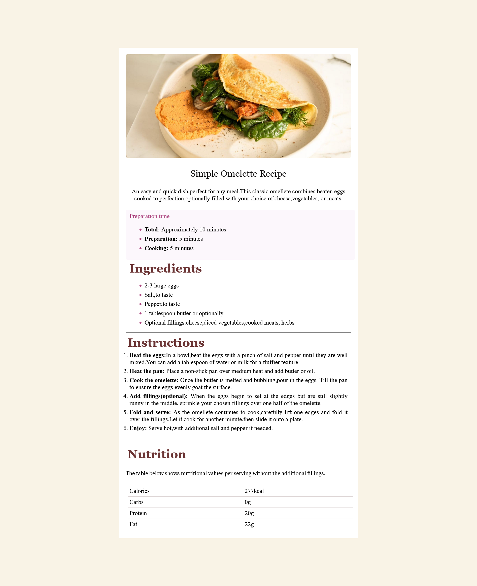

# Frontend Mentor - Recipe page solution

This is a solution to the [Recipe page challenge on Frontend Mentor](https://www.frontendmentor.io/challenges/recipe-page-KiTsR8QQKm). Frontend Mentor challenges help you improve your coding skills by building realistic projects. 

## Table of contents

- [Overview](#overview)
  - [The challenge](#the-challenge)
  - [Screenshot](#screenshot)
  - [Links](#links)
- [My process](#my-process)
  - [Built with](#built-with)
  - [What I learned](#what-i-learned)
  - [Continued development](#continued-development)
- [Author](#author)

## Overview

### Screenshot

### Links

- Solution URL: [Add solution URL here](https://github.com/Gettie1/Simple-Recipe-Page.git)
- Live Site URL: [Add live site URL here](https://your-live-site-url.com)

## My process

### Built with

- Semantic HTML5 markup
- CSS custom properties
- Flexbox
- CSS Grid

### What I learned

Throughout the challenge I lernt how to use different html tags and css styles I have never used before.

### Continued development
Going forward I want to to focus more on styling and creating responsive websites.

## Author

- Website - [Getrude Cheptoo ](https://www.your-site.com)
- Frontend Mentor - 
- LinkedIn - [Getrude Cheptoo ](https://www.https://www.linkedin.com/in/getrude-cheptoo-8859952b0?)

